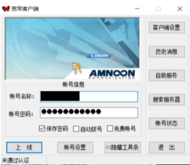

# 校园网认证

## Windows 系统

1. 安装校园网认证客户端

   下载地址：[百度网盘](https://pan.baidu.com/s/1xyDp5BxXsKBkL5jvYWDlaA)

   提取码 ：`1tno`

| 文件名称 | 文件用途 | 文件大小 |
| :--- | :--- | :--- |
| Edu\_Setup.exe | 校园网客户端安装包 | 2.40MB |
| WinPcap\_4\_1\_3.exe | 降低网卡版本 | 893KB |

* 安装 `WinPcap_4_1_3.exe` ，如果不安装的话可能会无法识别到网卡。
* 安装 `Edu_Setup.exe`
* 打开认证客户端（俗称小蝴蝶）

  输入账号密码登陆即可

  

## Linux / Mac OS 系统

1. 安装 MentoHust

   使用下载适用于自己的操作系统的安装包

   下载地址：[百度网盘](https://pan.baidu.com/s/1Oy0ILi6KszilRsc7ZD-0lg)

   提取码：`xd63`

| 文件名 | 操作系统 | 描述 |
| :--- | :--- | :--- |
| CocoaMento.dmg | Mac OS | Mac OS 下带图形界面的MentoHust |
| mentohust\_0.3.4-1-2\_i386.deb | Debian | 适用于32位Debian系统 |
| mentohust-0.3.4-1-2.el6.pcc64.rpm | RHEL/CentOS 6 | 64位 ppc rpm 包 |
| mentohust\_0.3.4-1-2.el6.x86\_64.rpm | RHEL/CentOS 6 | 64位 rpm包 |
| mentohust\_0.3.4-1-2.el6.i386.rpm | RHEL/CentOS 6 | 32位 rpm包 |
| mentohust\_0.3.4-1\_i386.deb | Ubuntu | 32位 deb包 |
| mentohust\_0.3.4-1\_amd64.deb | Ubuntu | 64位 deb包 |
| mentohust\_0.3.4-1.fc12.ppc64.rpm | Fedora 12 | 64位 ppc rpm 包 |
| mentohust\_0.3.4-1.fc12.x86\_64.rpm | Fedora 12 | 64位 rpm包 |
| mentohust\_0.3.4-1.fc12.i386.rpm | Fedora 12 | 32位 rpm包 |
| mentohust\_0.3.4-1.fc13.x86\_64.rpm | Fedora 13/14/15/16 | 64位 rpm包 |
| mentohust\_0.3.4-1.fc13.i386.rpm | Fedora 13/14/15/16 | 32位 rpm包 |

1. 运行 MentoHust

```text
# cd 到mentohust目录下
$ sudo mkdir /etc/mentohust
$ sudo cp ./8021x.exe /etc/mentohust
$ sudo cp ./W32N55.dll /etc/mentohust

$ sudo mentohust -u <学号> -p <校园网密码> -n <网卡名> -a0 -d0
```

如果认证失败，再切换回mentohust目录下：

```text
$ sudo cp./SuConfig.dat /etc/mentohust

$ sudo mentohust -u <学号> -p <校园网密码> -n <网卡名> -a0 -d0
```

* MentoHust 命令：

```text
用法:    mentohust [-选项][参数]
选项:    -h 显示本帮助信息
    -k 退出程序
    -w 保存参数到配置文件
    -u 用户名
    -p 密码
    -n 网卡名
    -i IP[默认本机IP]
    -m 子网掩码[默认本机掩码]
    -g 网关[默认0.0.0.0]
    -s DNS[默认0.0.0.0]
    -o Ping主机[默认0.0.0.0，表示关闭该功能]
    -t 认证超时(秒)[默认8]
    -e 响应间隔(秒)[默认30]
    -r 失败等待(秒)[默认15]
    -a 组播地址: 0(标准) 1(锐捷) 2(赛尔) [默认0]
    -d DHCP方式: 0(不使用) 1(二次认证) 2(认证后) 3(认证前) [默认0]
    -b 是否后台运行: 0(否) 1(是，关闭输出) 2(是，保留输出) 3(是，输出到文件) ［默认0］
    -y 是否显示通知: 0(否) 1～20(是)[默认5］
    -f 自定义数据文件[默认不使用]
    -c DHCP脚本[默认dhclient]
使用时请确保是以root权限运行！
```

