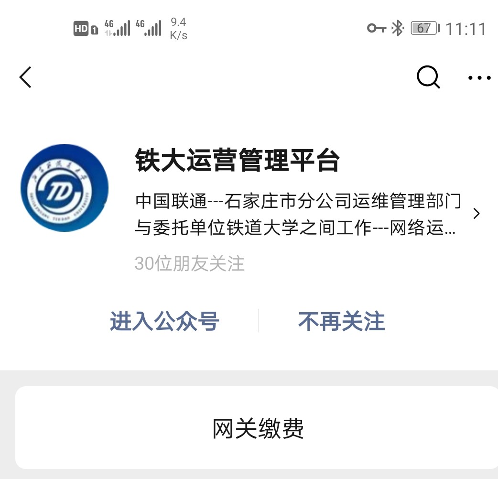
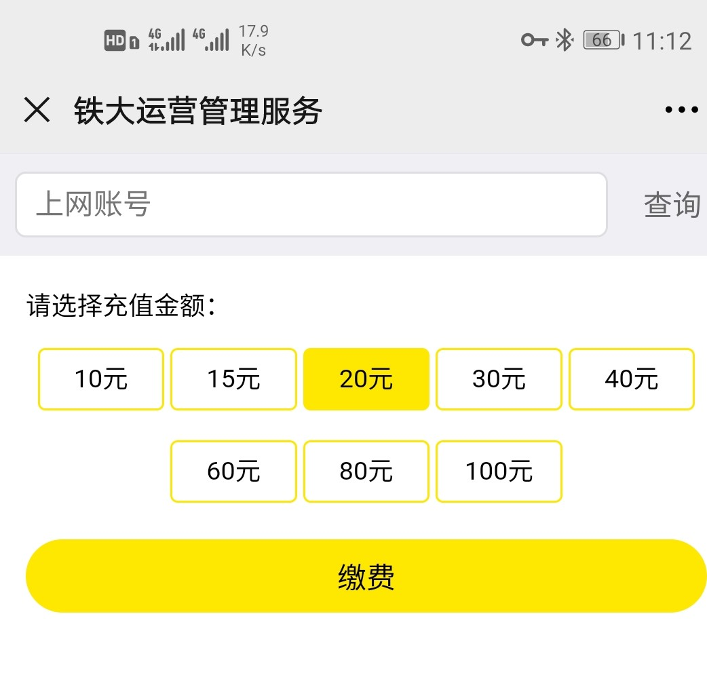

# 校园网缴费

开通校园网后需要缴费才可以访问外网。

## 套餐

校园网套餐分为两种：

|  | 流量 | 资费 |
| :--- | :--- | :--- |
| LIANTONG-学生区不限流量 | 不限 | ￥20/月 |
| LIANTONG-学生区10G | 10G/月 | ￥10/月 |

**现在校园网限制每个账号只能连接2台设备，实际上可以连接电脑、手机、Pad各一台左右。**

注册校园网时默认LIANTONG-学生区不限量套餐。（个人建议大家不要用10G套餐，因为根本不够用）

## 缴费流程

1. 微信关注“铁大运营管理平台”

   

2. 点击下方“网管缴费”
3. 输入学号，点击查询

   

4. 选择充值价格，付费充值

