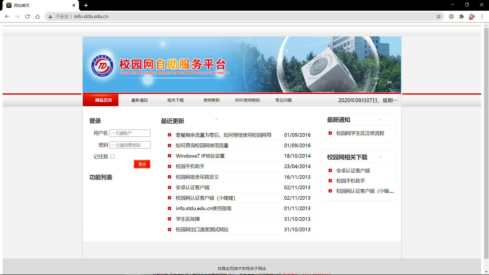
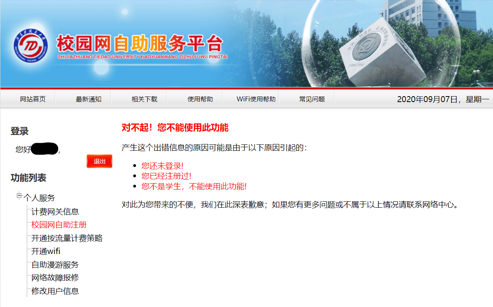
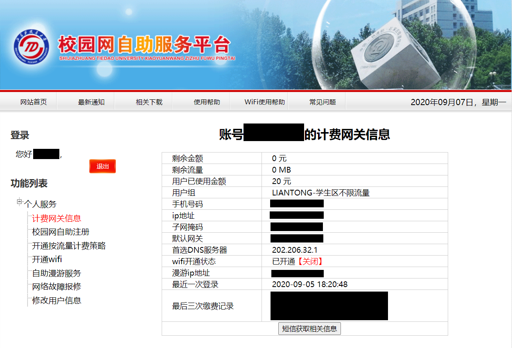

# 校园网注册

## 1. 在任意一台可以连接校园网的电脑上登录“石家庄铁道大学自助服务中心”（[http://info.stdu.edu.cn](http://info.stdu.edu.cn)）;

## 2. 用学号和消费密码登录（即刷饭卡的时候输入的密码）

## 3. 点击“校园网自助注册”，填写信息，记住密码（这个密码是用来登录校园网的），然后提交：

​ **PS**：一定要填写正确的手机号码，系统会把相关配置通过短信的方式发送到你的手机上。

​ **PS**：建议不要用 19X，17X 开头的手机号码，系统无法识别这些新号段的号码。

​ ↑ 如果你没有注册过的话这里应该是会让填写个人信息的

## 4. 注册成功以后，记住这里的IP地址，子网掩码，默认网关和自动DNS服务器。

